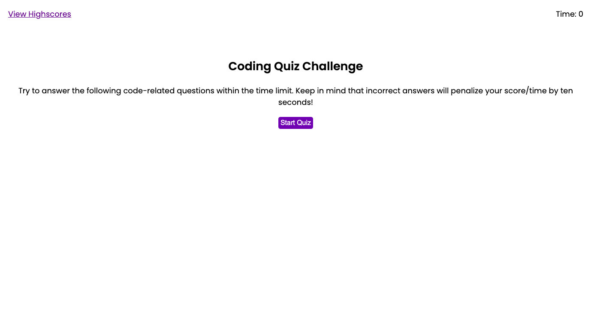

# coding-quiz

This five-question quiz will quiz the user's knowledge of some U.S. history. The user will click the start button to begin taking the quiz and thus, start their two minute timer. Upon clicking their answer choice, the next question and set of multiple choice answers will be displayed. If the user gets the question wrong, they are penalized by losing 5 seconds from their timer and consequently, 5 points from their "score." When all the questions are answered, or time has run out, the user will be able to enter their initials and save their score. Once their initials are submitted, the user will be allowed to click "go back" to return to the homepage and possibly take the quiz again or the clear highscores button, which will clear the history of highscores previously acquired. The quiz will render as follows:

